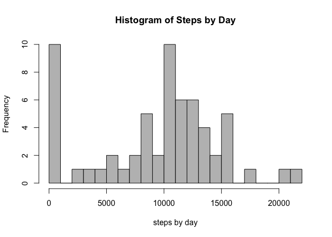
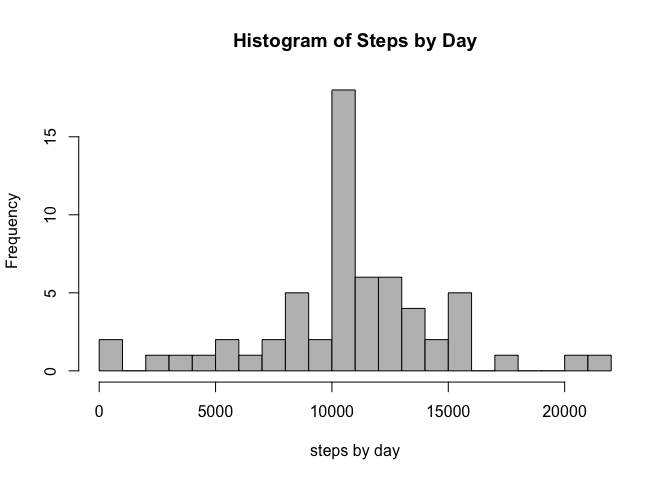
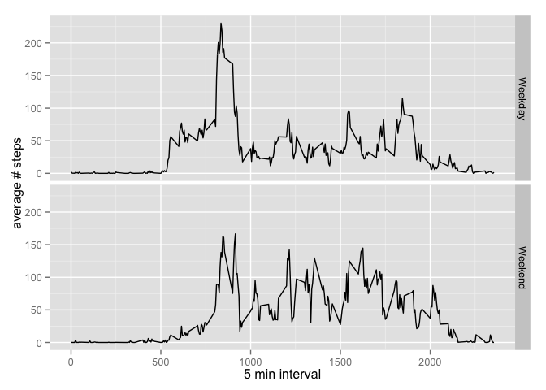

# Reproducible Research: Peer Assessment 1


## Loading and preprocessing the data


```r
unzip(zipfile = 'activity.zip')
data <- read.csv('activity.csv')
summary(data)
```

```
##      steps                date          interval     
##  Min.   :  0.00   2012-10-01:  288   Min.   :   0.0  
##  1st Qu.:  0.00   2012-10-02:  288   1st Qu.: 588.8  
##  Median :  0.00   2012-10-03:  288   Median :1177.5  
##  Mean   : 37.38   2012-10-04:  288   Mean   :1177.5  
##  3rd Qu.: 12.00   2012-10-05:  288   3rd Qu.:1766.2  
##  Max.   :806.00   2012-10-06:  288   Max.   :2355.0  
##  NA's   :2304     (Other)   :15840
```

Convert date to date format in r


```r
data$date <- as.Date(data$date)
head(data)
```

```
##   steps       date interval
## 1    NA 2012-10-01        0
## 2    NA 2012-10-01        5
## 3    NA 2012-10-01       10
## 4    NA 2012-10-01       15
## 5    NA 2012-10-01       20
## 6    NA 2012-10-01       25
```

## What is mean total number of steps taken per day?

Summing setps by day, while removing NA. After, a simple histogram. Finally, calculates mean and median.


```r
data.stepsbyday <- aggregate(data$steps, by=list(data$date), FUN=sum, na.rm=TRUE)
hist(data.stepsbyday$x, breaks=20, col='gray', 
     main = 'Histogram of Steps by Day', xlab = 'steps by day')
```

 

```r
data.meanstepsbyday <- mean(data.stepsbyday$x, na.rm=TRUE)
data.medianstepsbyday <- median(data.stepsbyday$x, na.rm=TRUE)

# setting print format option for numbers
options(scipen=1, digits=0)
```

The mean is **9354**. The median is **10395**. 

## What is the average daily activity pattern?

Draws a plot with with average amount of steps taken vs. 5-min interval across all days.


```r
data.stepsby5min <- aggregate(data$steps, by=list(data$interval), FUN=mean, na.rm=TRUE)
plot(data.stepsby5min$Group.1, data.stepsby5min$x, type = 'l', 
     main = 'Average steps by 5 min interval', 
     xlab = '5 min interval', ylab = 'average # steps across all days')
```

 

```r
# Finds the 5-min interval where average across all days reaches the max
intmax <- data.stepsby5min$Group.1[which.max(data.stepsby5min$x)]
```

The 5-minute interval where the average across all days reaches the max is : **835**.

## Imputing missing values


```r
data.amountna <- sum(is.na(data$steps))
data.naperc <- data.amountna / nrow(data) * 100
```

There's total of **2304** missig values in the dataset, which is about **13%** of the total number of rows.

A simple strategy would be fill in days / 5-minutes intervals with the average from all other days. Bellow, a new dataset is created using such strategy. A histogram, mean and mediam are presented.


```r
data.nona <- data
data.nonaindx <- which(is.na(data.nona$steps), arr.ind=TRUE)
for (i in data.nonaindx) {
    data.nona$steps[i] <- data.stepsby5min[
      which(data.stepsby5min$Group.1==data.nona$interval[i]),]$x
}
data.nona.stepsbyday <- aggregate(data.nona$steps, by=list(data.nona$date), FUN=sum, na.rm=TRUE)
hist(data.nona.stepsbyday$x, breaks=20, col='gray', 
     main = 'Histogram of Steps by Day', xlab = 'steps by day')
```

 

```r
data.nona.meanstepsbyday <- mean(data.nona.stepsbyday$x, na.rm=TRUE)
data.nona.medianstepsbyday <- median(data.nona.stepsbyday$x, na.rm=TRUE)
```

The new mean is **10766**. The new median is **10766**.

There's a clear difference from the initial mean and initial median. Although, they wouldn't be that different if in the first aggregate function NA's haven't been removed.

## Are there differences in activity patterns between weekdays and weekends?

Adds a new column containing 'Weekday' if day is Monday, Tuesday, Wednesday, Thursday or Friday or 'Weekend' if day is Saturday or Sunday. Aggregates data accordingly and plots a multipanel plot.


```r
weekend <- c("Saturday","Sunday")
data.nona$weekday <- ifelse(weekdays(data.nona$date) %in% weekend, "Weekend" , "Weekday")
data.nona.stepsbyWeekend <- aggregate(steps ~ interval+weekday, data = data.nona, mean)

library(lattice)
xyplot(steps ~ interval | weekday, data.nona.stepsbyWeekend, type = "l", layout = c(1,2), 
       xlab = "5 min interval", ylab = "average # steps", 
       col = "steelblue")
```

 

